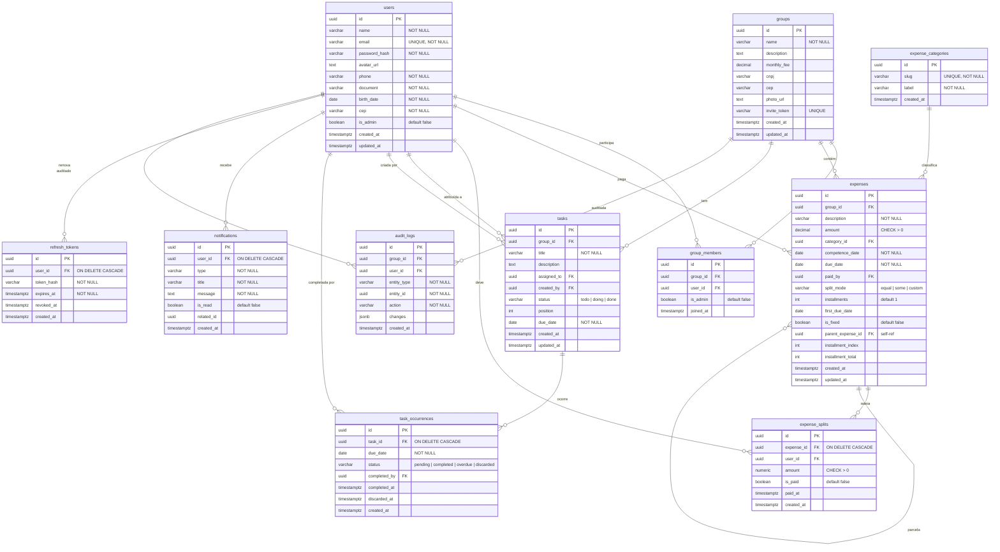

# Diagrama Entidade-Relacionamento (DER)

```mermaid
erDiagram
    users {
        uuid id PK
        varchar name "NOT NULL"
        varchar email "UNIQUE, NOT NULL"
        varchar password_hash "NOT NULL"
        text avatar_url
        varchar phone "NOT NULL"
        varchar document "NOT NULL"
        date birth_date "NOT NULL"
        varchar cep "NOT NULL"
        boolean is_admin "default false"
        timestamptz created_at
        timestamptz updated_at
    }

    groups {
        uuid id PK
        varchar name "NOT NULL"
        text description
        decimal monthly_fee
        varchar cnpj
        varchar cep
        text photo_url
        varchar invite_token "UNIQUE"
        timestamptz created_at
        timestamptz updated_at
    }

    group_members {
        uuid id PK
        uuid group_id FK
        uuid user_id FK
        boolean is_admin "default false"
        timestamptz joined_at
    }

    expense_categories {
        uuid id PK
        varchar slug "UNIQUE, NOT NULL"
        varchar label "NOT NULL"
        timestamptz created_at
    }

    expenses {
        uuid id PK
        uuid group_id FK
        varchar description "NOT NULL"
        decimal amount "CHECK > 0"
        uuid category_id FK
        date competence_date "NOT NULL"
        date due_date "NOT NULL"
        uuid paid_by FK
        varchar split_mode "equal | some | custom"
        int installments "default 1"
        date first_due_date
        boolean is_fixed "default false"
        uuid parent_expense_id FK "self-ref"
        int installment_index
        int installment_total
        timestamptz created_at
        timestamptz updated_at
    }

    expense_splits {
        uuid id PK
        uuid expense_id FK "ON DELETE CASCADE"
        uuid user_id FK
        numeric amount "CHECK > 0"
        boolean is_paid "default false"
        timestamptz paid_at
        timestamptz created_at
    }

    tasks {
        uuid id PK
        uuid group_id FK
        varchar title "NOT NULL"
        text description
        uuid assigned_to FK
        uuid created_by FK
        varchar status "todo | doing | done"
        int position
        date due_date "NOT NULL"
        timestamptz created_at
        timestamptz updated_at
    }

    task_occurrences {
        uuid id PK
        uuid task_id FK "ON DELETE CASCADE"
        date due_date "NOT NULL"
        varchar status "pending | completed | overdue | discarded"
        uuid completed_by FK
        timestamptz completed_at
        timestamptz discarded_at
        timestamptz created_at
    }

    audit_logs {
        uuid id PK
        uuid group_id FK
        uuid user_id FK
        varchar entity_type "NOT NULL"
        uuid entity_id "NOT NULL"
        varchar action "NOT NULL"
        jsonb changes
        timestamptz created_at
    }

    notifications {
        uuid id PK
        uuid user_id FK "ON DELETE CASCADE"
        varchar type "NOT NULL"
        varchar title "NOT NULL"
        text message "NOT NULL"
        boolean is_read "default false"
        uuid related_id
        timestamptz created_at
    }

    refresh_tokens {
        uuid id PK
        uuid user_id FK "ON DELETE CASCADE"
        varchar token_hash "NOT NULL"
        timestamptz expires_at "NOT NULL"
        timestamptz revoked_at
        timestamptz created_at
    }

    %% Relationships
    users ||--o{ group_members : "participa"
    groups ||--o{ group_members : "tem"

    users ||--o{ expenses : "paga"
    groups ||--o{ expenses : "contém"
    expense_categories ||--o{ expenses : "classifica"
    expenses ||--o{ expense_splits : "rateia"
    expenses ||--o{ expenses : "parcela"

    users ||--o{ expense_splits : "deve"

    groups ||--o{ tasks : "tem"
    users ||--o{ tasks : "atribuída a"
    users ||--o{ tasks : "criada por"
    tasks ||--o{ task_occurrences : "ocorre"
    users ||--o{ task_occurrences : "completada por"

    users ||--o{ notifications : "recebe"

    users ||--o{ refresh_tokens : "renova"

    groups ||--o{ audit_logs : "auditada"
    users ||--o{ audit_logs : "auditado"
```
