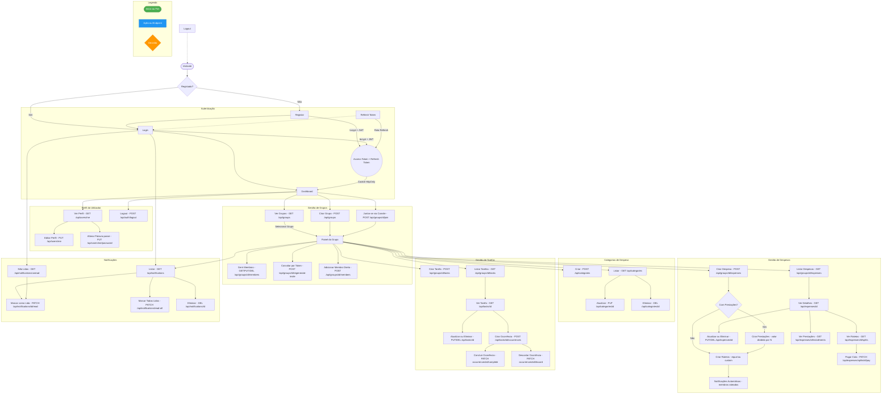

# Fluxo do Utilizador

```mermaid
flowchart TD
    %% Estilos
    classDef start    fill:#4CAF50,color:#fff,stroke:#388E3C
    classDef action   fill:#2196F3,color:#fff,stroke:#1976D2
    classDef decision fill:#FF9800,color:#fff,stroke:#F57C00
    classDef endNode  fill:#f44336,color:#fff,stroke:#D32F2F

    %% ==================== FLUXO PRINCIPAL ====================
    A([Visitante]) --> B{Registado?}
    B -->|Não| C[Registar]
    B -->|Sim| D[Login]
    C --> D
    D --> E[Dashboard]

    F[Refresh Token] -.-> D
    G[Logout] -.-> A

    %% ==================== AUTENTICAÇÃO ====================
    subgraph Autenticacao [Autenticação]
        C1((Access Token + Refresh Token))

        C -->|bcrypt + JWT| C1
        D -->|bcrypt + JWT| C1
        F -->|Rota Refresh| C1
        C1 -->|Cookie HttpOnly| E
    end

    %% ==================== PERFIL ====================
    subgraph Perfil [Perfil do Utilizador]
        AF[Ver Perfil - GET /api/users/me]
        AG[Editar Perfil - PUT /api/users/me]
        AH[Alterar Palavra-passe - PUT /api/users/me/password]
        AI[Logout - POST /api/auth/logout]

        AF --> AG
        AF --> AH
    end

    E --> AF
    E --> AI

    %% ==================== GRUPOS ====================
    subgraph Grupos [Gestão de Grupos]
        K[Criar Grupo - POST /api/groups]
        M[Ver Grupos - GET /api/groups]
        N[Juntar-se via Convite - POST /api/groups/id/join]
        O[Gerir Membros - GET/PUT/DEL /api/groups/id/members]
        P[Convidar por Token - POST /api/groups/id/regenerate-invite]
        R[Adicionar Membro Direto - POST /api/groups/id/members]
        S[Painel do Grupo]

        M -->|Selecionar Grupo| S
        K --> S
        N --> S
        S --> O
        S --> P
        S --> R
    end

    E --> K
    E --> M
    E --> N

    %% ==================== DESPESAS ====================
    subgraph Despesas [Gestão de Despesas]
        T[Criar Despesa - POST /api/groups/id/expenses]
        T1{Com Prestações?}
        T2[Criar Prestações - valor dividido por N]
        T3[Criar Rateios - equal ou custom]
        T4[Notificações Automáticas - membros rateados]
        U[Listar Despesas - GET /api/groups/id/expenses]
        V[Ver Detalhes - GET /api/expenses/id]
        W[Atualizar ou Eliminar - PUT/DEL /api/expenses/id]
        X[Ver Rateios - GET /api/expenses/id/splits]
        Y[Pagar Cota - PATCH /api/expenses/splits/id/pay]
        Z[Ver Prestações - GET /api/expenses/id/installments]

        T --> T1
        T1 -->|Sim| T2
        T1 -->|Não| T3
        T2 --> T3
        T3 --> T4
        U --> V
        V --> W
        V --> X
        V --> Z
        X --> Y
    end

    S --> T
    S --> U

    %% ==================== CATEGORIAS ====================
    subgraph Categorias [Categorias de Despesa]
        CA[Criar - POST /api/categories]
        CB[Listar - GET /api/categories]
        CC[Atualizar - PUT /api/categories/id]
        CD[Eliminar - DEL /api/categories/id]

        CB --> CC
        CB --> CD
    end

    S --> CA
    S --> CB

    %% ==================== TAREFAS ====================
    subgraph Tarefas [Gestão de Tarefas]
        TA[Criar Tarefa - POST /api/groups/id/tasks]
        TB[Listar Tarefas - GET /api/groups/id/tasks]
        TC[Ver Tarefa - GET /api/tasks/id]
        TD[Atualizar ou Eliminar - PUT/DEL /api/tasks/id]
        TE[Criar Ocorrência - POST /api/tasks/id/occurrences]
        TF[Concluir Ocorrência - PATCH occurrences/id/complete]
        TG[Descartar Ocorrência - PATCH occurrences/id/discard]

        TB --> TC
        TC --> TD
        TC --> TE
        TE --> TF
        TE --> TG
    end

    S --> TA
    S --> TB

    %% ==================== NOTIFICAÇÕES ====================
    subgraph Notificacoes [Notificações]
        NA[Listar - GET /api/notifications]
        NB[Não Lidas - GET /api/notifications/unread]
        NC[Marcar como Lida - PATCH /api/notifications/id/read]
        ND[Marcar Todas Lidas - PATCH /api/notifications/read-all]
        NE[Eliminar - DEL /api/notifications/id]

        NA --> NC
        NA --> ND
        NA --> NE
        NB --> NC
    end

    D --> NA
    D --> NB
    S --> NA

    %% ==================== LEGENDA ====================
    subgraph Legenda [Legenda]
        L1([Início ou Fim]):::start
        L2[Ação ou Endpoint]:::action
        L3{Decisão}:::decision
    end
```